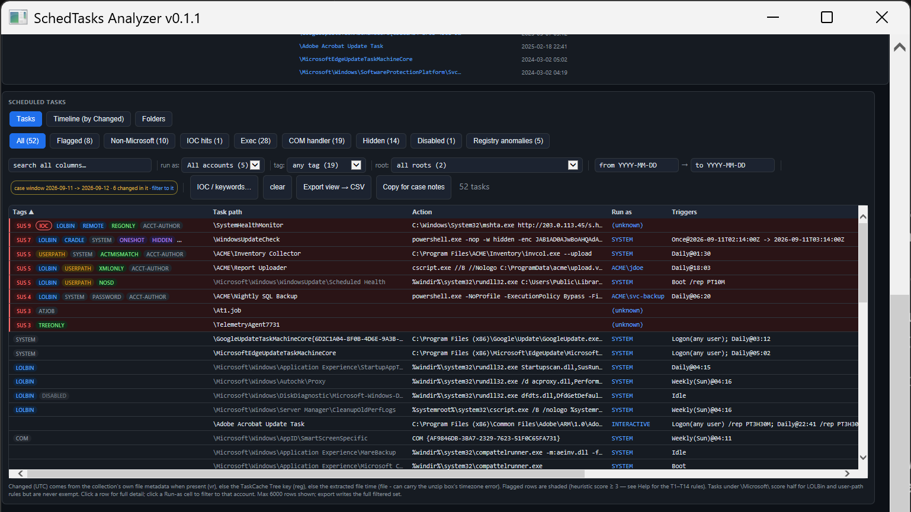
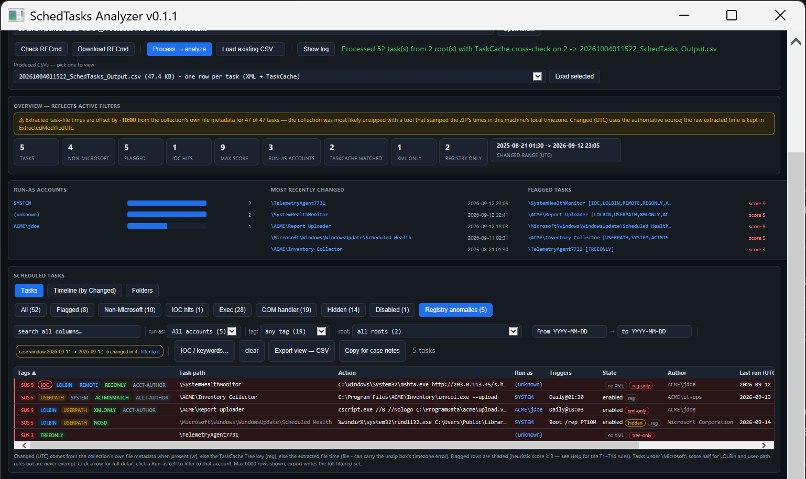
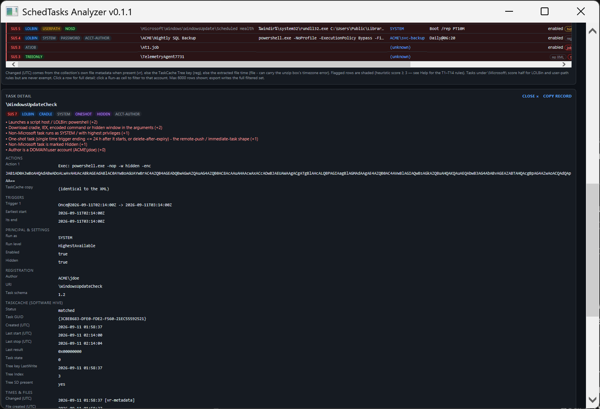

# SchedTasks-Analyzer

A single-file GUI for **Windows scheduled-task triage** — what is registered to run on a host, as whom, launching what, and which of it looks like persistence or lateral movement. It parses the Task Scheduler XML under `Windows\System32\Tasks` itself, cross-checks it against the SOFTWARE hive's **TaskCache** registry keys with Eric Zimmerman's [RECmd](https://github.com/EricZimmerman/RECmd), and turns both into one suspicion-scored, filterable view. One `.hta`, no install, part of the [DFIR-Windows-Artifact-Finder](https://github.com/bpmorris22/DFIR-Windows-Artifact-Finder) family.



> Tasks view over a synthetic server (`ACME-SRV02`): a registry-only `mshta http://…` task that matches the shared IOC list, an encoded-PowerShell one-shot running as SYSTEM, a registry/XML actions mismatch, an XML-only script task, a hidden `rundll32` task inside the Microsoft tree with its registry SD removed, an admin backup script, a legacy `At1.job` and a TaskCache residue of a removed task. Screenshots use synthetic data only.

## Field manual

A single-file **[manual](docs/SchedTasks-Analyzer-Manual.html)** covers what the tool reads, the TaskCache cross-check, trustworthy timestamps, every view, the full scoring table, a hunting playbook, the CLI and the CSV columns. GitHub won't render it inline: [download the raw file](https://raw.githubusercontent.com/bpmorris22/SchedTasks-Analyzer/main/docs/SchedTasks-Analyzer-Manual.html) and open it in any browser — or click **Instructions** inside the app.

## Quick start

1. Put `SchedTasks-Analyzer.hta` anywhere (ideally next to the rest of the toolkit) and double-click it.
2. Point the input at a **host or collection folder** — every `Windows\System32\Tasks`, `SysWOW64\Tasks` and legacy `Windows\Tasks` below it is found (Velociraptor / KAPE trees work as-is) — or at a single Tasks folder or task file.
3. Confirm the **Target hostname** guess, then **Process → analyze**. A host takes seconds. Or **Load existing CSV…** to reopen an earlier result.

The task XML parser is built in. RECmd is only needed for the registry cross-check: it is found next to the app (`RECmd\`, shared with [RECmd-Wrapper](https://github.com/bpmorris22/RECmd-Wrapper)) or in `C:\ZimmermanTools`, and **Download RECmd** fetches it from the official mirror. Without it the XML triage still runs.

## What it checks

- **Every task file**, copied to a short `%TEMP%` stage first (collected task paths routinely exceed 260 characters and evidence is never opened in place), parsed with DTDs prohibited and every value escaped before display. Non-XML files in a Tasks folder, UTF-8 task files and legacy `At<n>.job` files are flagged rather than skipped.
- **The TaskCache cross-check** (when the collection includes the SOFTWARE hive), joined by file location — never by the attacker-writable `<URI>`:
  - **registry-only** tasks whose XML was deleted, with their actions decoded from the registry;
  - **XML-only** files that were never registered;
  - **Tree-only residue** of tasks removed outside a normal delete;
  - **deleted** registrations RECmd recovers from the hive;
  - **hidden tasks** whose Tree key lost its SD value (the "Tarrask" technique) — skipped with a warning on a host where *most* entries lack an SD, which means a partial hive copy rather than tradecraft;
  - registry actions that **differ** from the XML;
  - registered and last-run times.
- **Trustworthy times** — files unzipped from an offline collection can carry the analysis box's timezone error. Changed (UTC) prefers the collection's own file metadata, then the TaskCache LastWrite, and the app warns when it detects a consistent offset.



## Views & scoring

- **Tasks** (score-ranked), **Timeline** (by Changed, UTC) and **Folders** (per task folder), with category chips (Flagged, Non-Microsoft, IOC hits, Exec, COM handler, Hidden, Disabled, Registry anomalies), free-text search, run-as / tag / root filters, a date window, a full detail pane with the raw XML, CSV export and case-note copy.
- Flagged at score ≥ 3. Signals:

  | Signal | Score |
  |---|---|
  | IOC hit | +3 |
  | Script host / LOLBin launcher, download cradle or encoded command, URL / UNC share | +2 each |
  | Runs from a user-writable location | +2 |
  | Non-Microsoft task running as SYSTEM, with S4U / stored credentials, hidden, or repeating every ≤ 15 min | +1 each |
  | One-shot trigger (the remote-push shape) | +1 |
  | Malformed, non-task or SysWOW64 task files | +1 to +2 |
  | `At<n>.job` | +3 |
  | TaskCache: no SD +3 · Tree-only residue +3 · registry-only +2 · actions mismatch +2 · XML-only +1 · recovered deleted +1 | as listed |

  Tasks under `\Microsoft\` score half on the LOLBin and user-path rules but are never exempt.



## Command line

```
mshta "SchedTasks-Analyzer.hta" "<inputOrCsv>" ["<outDir>"] [/auto] [/from:yyyy-MM-dd] [/to:yyyy-MM-dd]
```

- `<input>` — a `.csv` (opens in the viewer) or a host folder / Tasks folder / task file (prefilled; processed with `/auto`).
- `<outDir>` — output folder; defaults to `_Processed\<host>\SchedTasks` next to the app.
- **Target hostname** is required before processing — it names that folder (family convention shared with the [DFIR-Windows-Artifact-Finder](https://github.com/bpmorris22/DFIR-Windows-Artifact-Finder)). Guessed from `Collection-<host>-…` paths or a passed `_Processed\<host>\` outDir.
- **Shared IOC list** — an `IOC.txt` next to the app (one term per line, `#` comments) is merged into the IOC box at launch.
- **Run provenance + triage summary** — every run appends a `runinfo.json` entry (app, host, input, files, case window, flagged count, max score, top hits) in the output folder; the Artifact-Finder shows these per host. RECmd's raw TaskCache CSVs are kept in a `TaskCache\` subfolder.
- `/from:yyyy-MM-dd` `/to:yyyy-MM-dd` — case window (UTC, inclusive): tasks changed inside it are marked **in window** and counted in a chip beside the date boxes (**filter to it** applies it as a filter). It does **not** pre-filter the list — a task that matters is often created long before the window — and it is recorded in `runinfo.json` and never scored.

## Notes

- **Live machine:** the **This machine** button reads the local Tasks folder, which needs an elevated mshta. Windows keeps the live SOFTWARE hive locked, so live runs are XML-only.
- Task files and registry keys show what exists at collection time. Pair findings with TaskScheduler/Operational events 106 / 140 / 141 / 200 / 201 and Security 4698–4702 ([Hayabusa-Wrapper](https://github.com/bpmorris22/Hayabusa-Wrapper)), and with `$UsnJrnl` ([MFTECmd-Wrapper](https://github.com/bpmorris22/MFTECmd-Wrapper)).
- COM-handler actions are shown as raw CLSIDs; SIDs are raw apart from the well-known ones.
- CSV values are written unmodified and task arguments can begin with `-`, `+`, `=` or `@` — open the CSV in this app or Timeline Explorer rather than Excel.
- Requires Windows (mshta / IE-JScript host). Columns are resizable; drag a header edge, double-click to reset.

## Credits

TaskCache parsing by [RECmd](https://github.com/EricZimmerman/RECmd) and its TaskCache plugin, by Eric Zimmerman (not bundled; downloaded from the official mirror on request). Not affiliated with Microsoft or Eric Zimmerman.

MIT © 2026 Ben Morris
